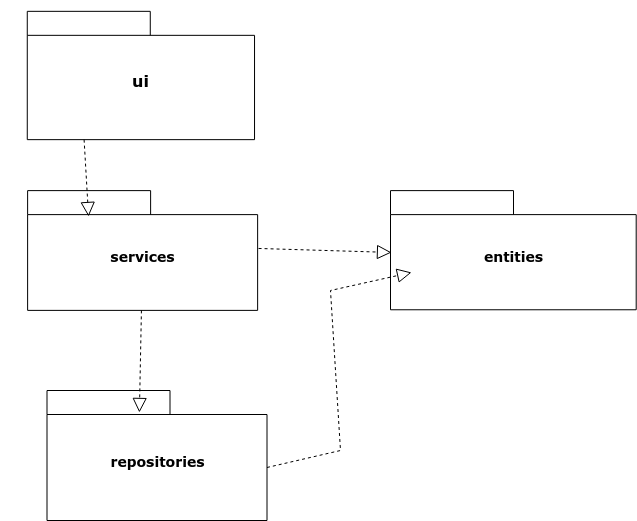
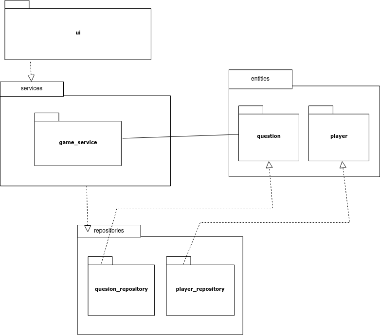
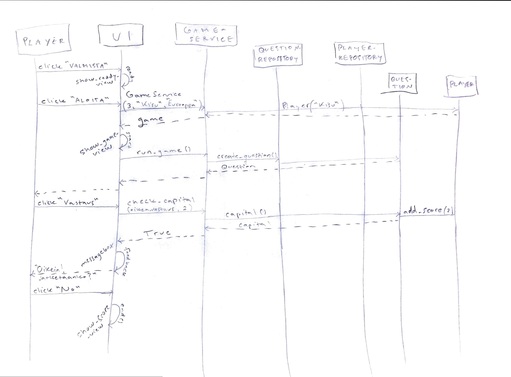

# Arkkitehtuurikuvaus

## Rakenne

Ohjelma on rakennettu kolmelle kerrokselle: käyttöliittymä, logiikkapalvelut ja repositoriot.

Koodi on pakattu hakemistoihin käyttötarkoituksen mukaan: ui sisältää käyttöliittymän, services sovelluslogiikan ja repositories tiedon lataamisen ja tallettamisen käsittävän koodin. Entities sisältää sovelluksen käyttämiä tietokohteita.

## Käyttöliittymä

Käyttöliittymä sisältää neljä erillistä näkymää:
* Aloitus
* Valmiina pelin aloitukseen
* Kolmen vaikeustason pelinäkymä, jossa nappien määrä vaihtelee
* Parhaat pisteet

Kaikki näkymät on toteutettu omina luokkinaan. Ui-luokka huolehtii yksi kerrallaan näkyvissä olevien näkymien vaihdosta. Käyttöliittymä on eroteltu sovelluslogiikasta, jota hoitaa luokka GameService.

## Sovelluslogiikka

Sovelluksen tietomallin muodostavat luokat Question ja Player, jotka kuvaavat pelin kysymyksiä ja pelaajaa. Pelin kysymykset luodaan kysymys-olioiksi ja pelin pelaajalle talletetaan nimimerkki ja pisteet.

GameService vastaa kaikesta peliin ja pisteisiin liittyvästä logiikasta. Luokka tarjoaa käyttöliittymän kaikki peliin liittyvät metodit, esimerkiksi:
* create_question()
* check_capital()
* save_score()
* get_highscores()

GameServicella on yhteys luokkiin QuestionRepository ja PlayerRepository, joiden kautta haetaan tiedot kysymyksiin ja hoidetaan pistetilaston haku ja talletus. Luokkien toteutus injektoidaan sovelluslogiikalle konstruktorikutsun yhteydessä.

## Tietojen tallennus

PlayerRepository-luokka huolehtii pisteiden talletuksesta CSV-tiedostoon. Molemmat repository-luokat myös lukevat tietoa CSV-tiedostoista.

## Päätoiminnallisuudet

Kahdessa aloitusnäkymässä valitaan pelin reunaehdot (ensimmäisessä perustiedot ja toisessa pelitapa). Pelaajan painettua ALOITA-näppäintä siirrytään pelinäkymään. Pelinäkymässä kutsutaan GameServiceä, jonka kautta luodaan uusi kysymys: Oikea vastaus tarkistetaan napin painalluksestas. Palaute vastauksesta (oikein/väärin) tulee vastausvaihtoehdon klikkauksen jälkeen tekstilaatikossa näkyviin. Peruspelissä laatikon nappivahtoehtoja *Yes* tai *No* klikkaamalla peli joko jatkuu tai päättyy. Pelin lopuksi pelaajan pisteet tulevat näkyviin infotekstilaatikkoon. *OK*-klikkauksella siirrytään parhaat pisteet -näkymään ja pelaaja voi palata alkunäkymään *PELAA UUDELLEEN*-painikkeella

Pelin aloittamisen ja yhden kysymyksen pelaamisen sovelluslogiikka:

## Ohjelman rakenteeseen jääneet heikkoudet

Graafisen käyttöliittymän aloitus- ja pelinäkymään jäi jonkin verran toisteista koodia.
