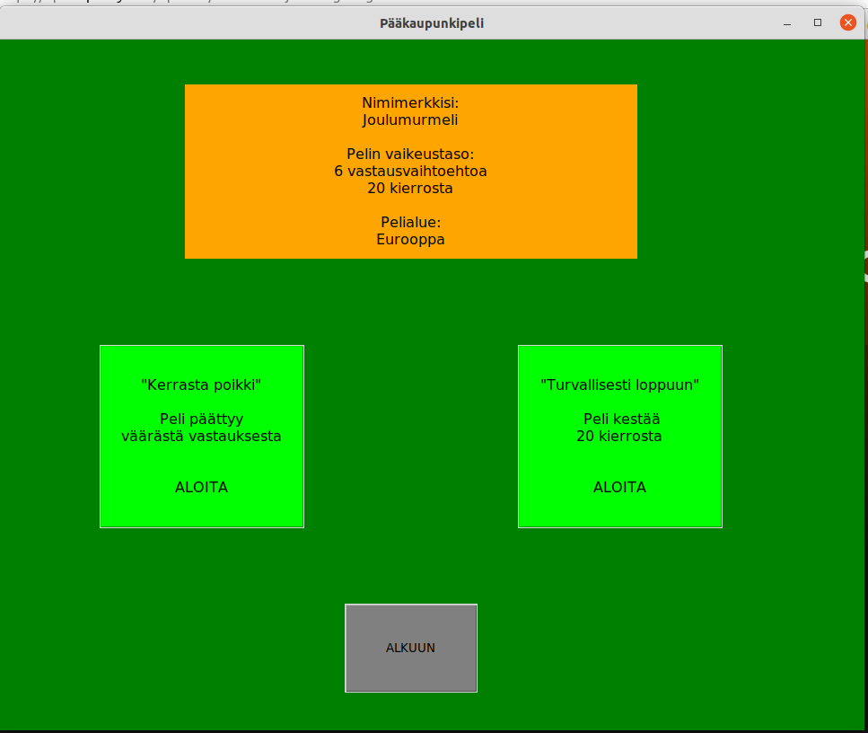

# Käyttöohje

Lataa projektin viimeisimmän releasen lähdekoodi valitsemalla *Assets*-osion alta *Source code*.

## Konfigurointi

Tallennukseen käytettävä pistetilastotiedoston on olemassa, mutta sen voi halutessaan konfiguroida .env-tiedostossa. Jos tiedostoa ei pisteitä kutsuttaessa ole olemassa, se luodaan automaattisesti *data*-hakemistoon. Tiedosto on muodossa:

```
SCORE_FILENAME=highscores.csv
```
Myös maalistauksen voi samoin konfiguroida itse, mutta listauksesta täytyy löytyä oikeat tiedot oikeassa järjestyksessä (maa,pääkaupunki,maanosa), jotta pelilogiikka toimii oikein. Maalista löytyy myös *data*-hakemistosta. Tiedostomuoto:

```
COUNTRIES_FILENAME=country_list_all_csv
```

## Ohjelman käynnistäminen

Ennen ohjelman käynnistämistä, asenna riippuvuudet komennolla:

```
poetry install
```

Riippuvuuksien asentamisen jälkeen ohjelman voi käynnistää komennolla:

```
poetry run invoke start
```

## Pelin aloittaminen

Sovellus käynnistää aloitusnäkymän:


Peli on mahdollista aloittaa oletusarvoilla (nimimerkki Maailmanmatkaaja, vaikeustaso 3, kierroksia 10, koko maailma), mutta pelaaja voi valita oman nimimerkin, vaikeustason, kierrosten määrän ja alueen, jolta kysymykset tulevat. Vaikeustasojen erona on vastausvaihtoehtojen määrä sekä pisteytys: tason kasvaessa pisteitä voi saada enemmän.

## Pelivalintojen vahvistaminen

Aloitusnäkymästä siirrytään pelivalintojen vahvistamiseen. Peli näyttää valitut peliasetukset ja nimimerkin:



Pelissä on valittavana kaksi pelimoodia: äkkikuolema, jossa peli päättyy väärästä vastauksesta, tai valittujen kierrosten mukainen peruspeli. Pelin voi valita painamalla kyseisen moodin aloitusnappia. Vaihtoehtona on myös palata aloitusnäkymään.

## Pelin pelaaminen

Pelin alkaessa näkyviin tulee valitun tason mukainen pelinäkymä:


Peruspelissä pelataan valittu määrä kierroksia, ellei pelaaja valitse pelin lopettamista aiemmin. Vastauksen klikkaamisen jälkeen näkyviin tulee kysymyslaatikko, jossa on palaute vastauksesta. Peliä voi jatkaa valitsemalla *Yes* tai lopettaa kesken valitsemalla *No*.


Viimeisen kysymyksen vastauksen (tai äkkikuolemassa väärän vastauksen tai alueen kysymysten loppumisen) jälkeen peli päättyy:

   

 OK-painiketta painamalla sovellus siirtyy pistetilastonäkymään.

## Pistetilasto

Näkyvillä on pistelista molemmista pelimuodoista, ja listoilla on kolmen parhaan pelaajan pelin tiedot:


Pelin voi pelata uudelleen klikkaamalla "PELAA UUDELLEEN" -painiketta.
