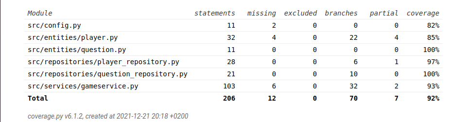

# Testaus

Ohjelman testaus tapahtuu integraatiotestauksen kautta unittestilla, jolloin myös yksittäiset luokat tulevat testatuksi riittävän tehokkaasti. Käyttöliittymää on testattu manuaalisesti.

## Yksikkö- ja integraatiotestaus

Testaus on jaettu sisällön mukaan kahteen osaan: pelin ja pisteytyksen testaamiseen. Luokka GameTest keskittyy testaamaan pelin toiminnallisuutta ja luokka ScoreTest pisteiden hakemista ja tallettamista.

Molemmissa testiluokissa alustetaan GameService kahdesti eri pelityypeillä. Testiluokkien kautta saadaan testattua tehokkaasti myös Player- ja Question-luokkia sekä molempia repositorio-luokkia. GameTest-luokassa QuestionRepositorya testataan osana pelilogiikkaa. PlayerRepositoryn toimintaa testataan enemmän ScoreTest-luokassa.

### Testikattiavuus

Testikattavuus on 93 %. Mukana ei ole käyttöliittymäluokkien testausta.

## Järjestelmätestaus

Sovelluksen testaaminen on suoritettu manuaalisesti.

### Asennus ja konfigurointi

Sovellusta on testattu Linux-ympäristössä. Testauksen aikana myös eri konfiguraatioita on kokeiltu *.env*-tiedoston kautta.

### Toiminallisuudet

Märittelydokumenttiin listatut toiminnallisuudet on testattu.

