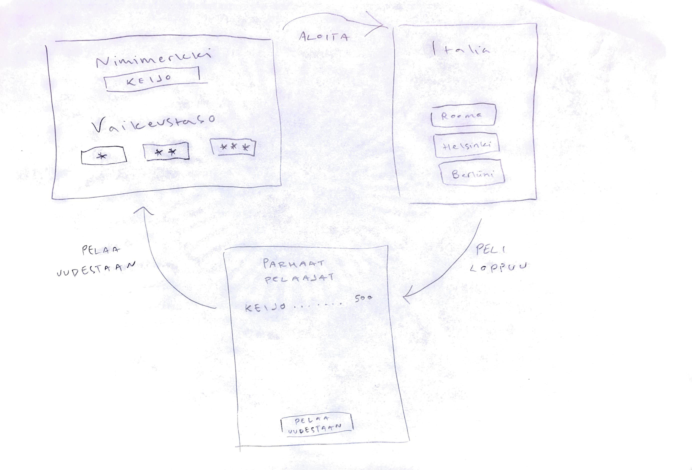

# Vaatimusmäärittely

## Sovelluksen tarkoitus

Sovellus on peli, jonka avulla voidaan harjoitella maailman maiden pääkaupunkeja.

## Käyttäjät

Sovelluksella on ainoastaan yksi käyttäjärooli eli *normaali käyttäjä*.

## Käyttöliittymäluonnos

Sovellus koostuu kolmesta eri näkymästä.

Pelin alkunäkymässä syötetään pelaajan nimimerkki ja valitaan vaikeustaso. Pelinäkymässä näkyviin tulee maa ja vastausvaihtoehdot. Pelin päätyttyä näkyviin tulee pistetilasto.

## Toiminnallisuus

### Sovelluksen käynnistyessä

* Pelaaja syöttää nimimerkin ja valitsee vaikeustason "tehty"
    * nimimerkin on oltava vähintään yhden merkin pituinen
    * ainakin pelin ensimmäisessä versiossa vaikeustasovalinta säätelee vastausvaihtoehtojen määrää "tehty"

* Pelinäkymässä näkyviin tulee maa, jonka pääkaupunkia kysytään "tehty"
    * pelaaja klikkaa mielestään oikeaa vaihtoehtoa "tehty"
    * oikeasta vastauksesta saa pisteitä "tehty"
    * pelin ensimmäisessä versiossa peli päättyy väärästä vastauksesta

* Pelin päätyttyä näkyviin tulee pistetilasto
    * listaus näyttää kymmenen parasta pelaajaa pisteineen
    * pelin voi sulkea tai pelata uudestaan "tehty"

## Jatkokehitysideoita

* Vaikeustason variantit
    * peli ei tarjoa vastausvaihtoehtoja, vaan käyttäjän täytyy kirjoittaa pääkaupunki itse
* Ajan kuluminen
    * jos pelaaja ei vastaa kuluvan ajan puitteissa, peli päättyy
* Elämät
    * pelaajalla on kolme elämää, joista väärä vastaus vähentää yhden
    * peli päättyy, kun kaikki elämät on käytetty
* Skippaa-toiminto
    * pelaaja voi hypätä maan yli kerran skippaustoiminnolla ilman että peli päättyy/menettää elämän
* Alueiden valinta
    * kysyttäviä maita voi rajata esim. maanosan mukaan
