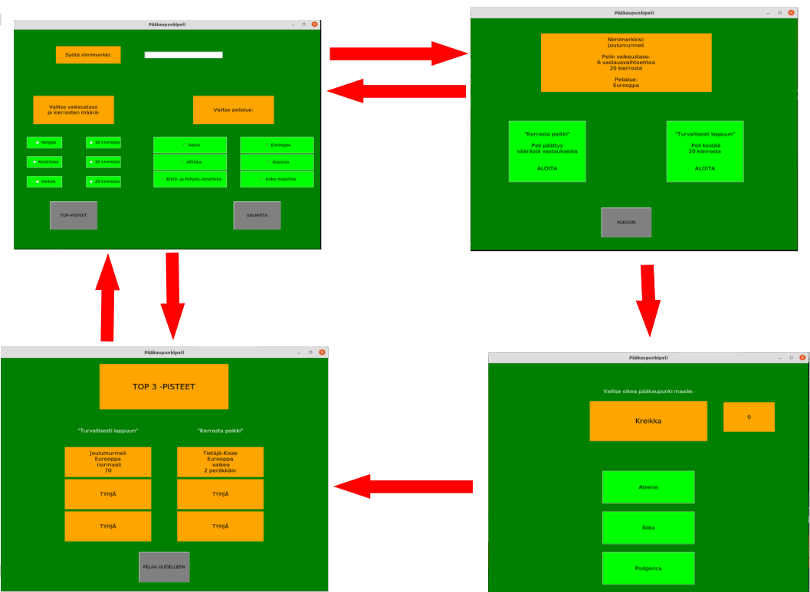

# Vaatimusmäärittely

## Sovelluksen tarkoitus

Sovellus on peli, jossa pelaajan täytyy yhdistää oikea pääkaupunki kysyttyyn maahan.

## Käyttäjät

Sovelluksella on ainoastaan yksi käyttäjärooli eli *normaali käyttäjä*.

## Käyttöliittymä

Sovellus koostuu neljästä eri näkymästä:

* Alkunäkymässä syötetään nimimerkki ja valitaan vaikeustaso sekä pelattava alue. Alkunäkymästä voi siirtyä myös pistetilastoihin.
*  Pelinäkymässä näkyviin tulee maa, vastausvaihtoehdot ja pisteet.
*  Pelin päätyttyä näkyviin tulee pistetilastosivu.

## Toiminnallisuus

### Sovelluksen käynnistyessä

* Pelaaja syöttää nimimerkin ja valitsee vaikeustason
    * nimimerkin on oltava vähintään yhden merkin pituinen. Jos nimeä ei syötetä, pelataan oletusnimellä *Maailmanmatkaaja*
    * Pelin taso säätelee vastausvaihtoehtojen määrää (kaksi, kolme, tai kuusi vaihoehtoa).
    * Pelialueeksi, eli miltä alueelta maat valitaan, voidaan valita eri maanosa tai koko maailma.

* Seuraavassa näkymässä varmistetaan tehdyt pelivalinnat ja valitaan pelitapa:
    * "Kerrasta poikki" käynnistää pelin, jossa tulee uusi kysymys, kunnes pelaaja vastaa väärin tai valitun alueen kaikki maat on kysytty.
    * "Turvallisesti loppuun" käynnistää pelin, jossa pelataan kymmenen kysymystä.
    * valintoja voi myös palata muuttamaan alkunäkymään

* Pelinäkymässä näkyviin tulee maa, jonka pääkaupunkia kysytään:
    * pelaaja valitsee vaihtoehdon klikkaamalla sitä
    * klikkauksen jälkeen näkyviin tulee vastauslaatikko, joka kertoo oliko vastaus oikein
    * peliä voi jatkaa valitsemalla *Yes* tai lopettaa kesken valitsemalla *No*
    * pelin päättyessä näkyviin tulee infolaatikko, joka kertoo pisteet
    * pisteet päivittyvät näkyviin vastauslaatikon klikkauksen jälkeen
    * 10 kierroksen pelissä pisteet määräytyvät vaikeustason ja ajan mukaan
    * äkkikuolemassa jokaisesta oikeasta vastauksesta saa pisteen

* Pelin päätyttyä näkyviin tulee pistetilasto:
    * kaksi eri listaa näyttävät kolme parasta pelaajaa molemmista pelitavoista
    * pelin voi sulkea tai pelata uudestaan

## Jatkokehitysideoita

* Vaikeustason variantit
    * peli ei tarjoa vastausvaihtoehtoja, vaan käyttäjän täytyy kirjoittaa pääkaupunki itse
* Ajan kuluminen
    * jos pelaaja ei vastaa kuluvan ajan puitteissa, peli päättyy
* Elämät
    * pelaajalla on äkkikuolema-pelissä kolme elämää, joista väärä vastaus vähentää yhden
    * peli päättyy vasta, kun kaikki elämät on käytetty
* Ohita-toiminto
    * pelaaja voi hypätä maan yli kerran ilman että peli päättyy/menettää elämän
* Alueiden valinta
    * kysyttävän alueen voi koostaa useammasta maanosasta
